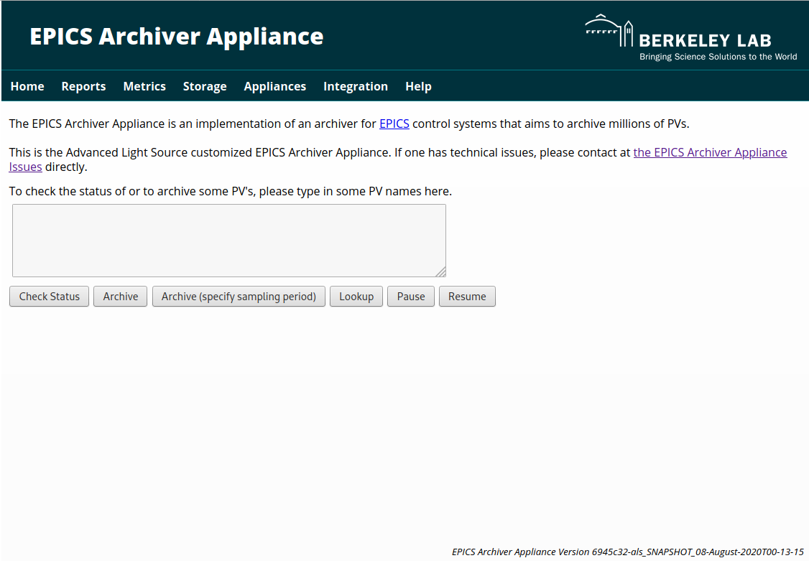

# EPICS Archiver Appliance Configuration Environment


Configuration Environment for EPICS Archiver Appliance at <https://github.com/slacmshankar/epicsarchiverap>

## Requirements

### Download source code first

```bash
make init
```

### Install required packages

* Debian 10 / CentOS 8

```bash
make install.pkgs
```

Note that MariaDb should be started before further steps.

```bash
sudo systemctl start mariadb
```

### Tomcat 9

* Debian 10 : tomcat9 will be installed through `make install.pkgs`

* CentOS 8 : See  [docs/README.tomcat.md](docs/README.tomcat.md)

### MariaDB

* JDBC connector

It is inside the site specific building procedure, so don't need to do anything.

* Create the DB and itsuser : `archappl`

If the MariDB has already `admin` account, please use it with the modification in `configure/CONFIG_COMMOM`.
With the admin account, create `db` and `user` for the archiver appliance.

```bash
make db.create
```

If one cannot get results properly by `make db.show`, please run `make addAdmin`. Thus, from scratch, one should do

```bash
make db.secure
make db.addAdmin
make db.show
make db.create
make db.show
```

* Create and fill the tables

```bash
make sql.fill
make sql.show
```

Please see [docs/README.mariadb.md](docs/README.mariadb.md) for the further information.

### JAVA and Ant

For JAVA and Ant configuration, please look at the generic Java Environment [1].

For the testing purpose, one can use the local JAVA and Ant environments. The java 11/12 and Ant.

See [docs/README.javapkgs.md](docs/README.javapkgs.md)

* Debina 10 System

```bash
JAVA_HOME:=/usr/lib/jvm/java-11-openjdk-amd64
ANT_HOME:=/usr/share/ant
TOMCAT_HOME:=/usr/share/tomcat9
```

* CentOS 8 System

Choose the JDK 11, instead of 8 via

```bash
sudo update-alternatives --config java
```

```bash
JAVA_HOME:=/usr/lib/jvm/java-11-openjdk-11.0.8.10-0.el8_2.x86_64/
ANT_HOME:=/usr/share/ant
TOMCAT_HOME:=/opt/tomcat9
```

## TL;DR for Debian 10

```bash
make build
make install
make sd_start
make sd_status
```

||
| :---: |
|**Figure 1** Firefox Archiver Appliance Home Page Screenshot.|

* Startup services

```bash
systemctl start epicsarchiverap.service
```

* Stop Services

```bash
systemctl stop epicsarchiverap.service
```

## CentOS 7

I think, at this moment, with the latest commit, it works because I removed some MariaDB (>= 10.1.1) related DB field in the dababase management bash script. Please let me know if there is any related bugs. I don't have resouces to test this environment with CentOS 7 now. This repository doesn't support MySQL or MariaDB compatiable with MySQL 5.6 and lower version. Please upgrade the MariaDB through <https://mariadb.com/docs/deploy/upgrade-community-server-cs105-centos7/> or latest one.

## CentOS 8

CentOS 8 is going to somewhere in a different universe, where I don't want to be. Please use Debian 10 instead of CentOS 8. If one would like to use CentOS, please go to CentOS 7 or in near future to Rocky Linux.

See [docs/README.Centos8.md](docs/README.Centos8.md)

### Build

* Generate all configuration files, and prepare the storage space, and build the archiver appliance

```bash
make build
```

which contains three rules such as `conf.archapplproperties`, `conf.storage`, and `build.ant`

### Install

```bash
make install
```

### Systemd

```bash
make sd_start
make sd_status
```

## References

[1] <https://github.com/jeonghanlee/java-env>
